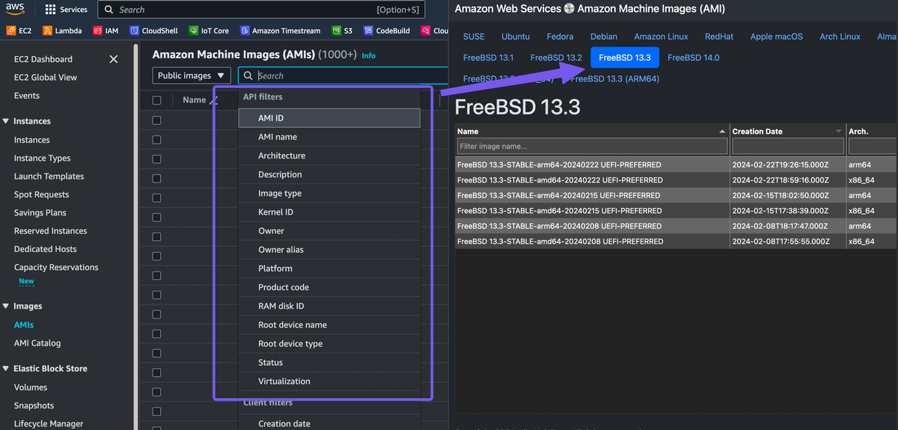

# AWS AMI Quick Search & Filter

[](#readme)
[](https://github.com/Cyclenerd/aws-ami/actions/workflows/build.yml)
[](https://github.com/Cyclenerd/aws-ami/blob/master/LICENSE)

This web application streamlines your workflow by providing a fast and convenient way to search and filter Amazon Machine Images (AMIs) for Amazon Web Services (AWS) EC2 instances.
Tired of the slow and cumbersome experience with the official AWS console?
This app is designed to be your go-to tool for efficiently finding the right AMIs for your needs.

[](https://ami.nkn-it.de/)

Key Features:

* **Search:** Quickly locate AMIs by name, description, or other relevant criteria.
* **Filter:** Narrow down your search results based on operating system and other desired attributes.

Benefits:

* **Save time:** Find the right AMIs quickly and effortlessly, freeing you to focus on other development tasks.
* **Improve efficiency:** Eliminate navigating the official AWS console.

## 💿 New Image (Version)

1. Edit [`operating-systems.json`](./build/operating-systems.json)
1. Done

## 🧑‍💻 Development

This project uses GitHub Actions for automated builds and deployments.
Ready to tweak and test this webapp locally?
Follow these instructions:

### Requirements

* AWS CLI (`aws`)
* JSON processor (`jq`)
* SQLite3 (`sqlite3`)
* Perl 5 (`perl`)
* Perl modules:
	* [JSON::XS](https://metacpan.org/pod/JSON::XS)
	* [Template::Toolkit](https://metacpan.org/pod/Template::Toolkit)
	* [plackup](https://metacpan.org/dist/Plack/view/script/plackup)

<details>
<summary><b>Debian/Ubuntu</b></summary>

Packages:

```shell
sudo apt update
sudo apt install \
	awscli \
	jq \
	libjson-xs-perl \
	libplack-perl \
	libtemplate-perl \
	sqlite3
```
</details>

<details>
<summary><b>macOS</b></summary>

Homebrew packages:

```bash
brew install \
	awscli \
	cpanminus \
	jq \
	perl \
	pkg-config \
	sqlite3
```

Perl modules:

```shell
cpanm --installdeps .
```
</details>

Build:

```shell
cd build
bash build.sh
perl web.pl
```

Run:

```shell
plackup --host "127.0.0.1" --port "8080"
```

## ❤️ Contributing

Have a patch that will benefit this project?
Awesome! Follow these steps to have it accepted.

1. Please read [how to contribute](CONTRIBUTING.md).
1. Fork this Git repository and make your changes.
1. Create a Pull Request.
1. Incorporate review feedback to your changes.
1. Accepted!

## 📜 License

All files in this repository are under the [Apache License, Version 2.0](./LICENSE) unless noted otherwise.

Portions of this webapp are modifications based on work created and shared by [Amazon Web Services](https://aws.amazon.com/terms/) and used according to terms described in the [Creative Commons 4.0 Attribution-ShareAlike License](https://creativecommons.org/licenses/by-sa/4.0/).

Please note:

* No warranty
* No official Amazon Web Services product